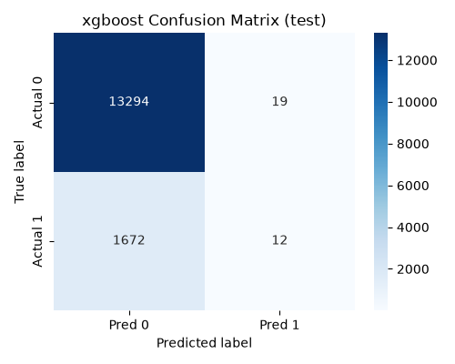
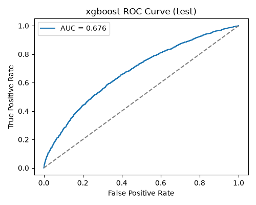
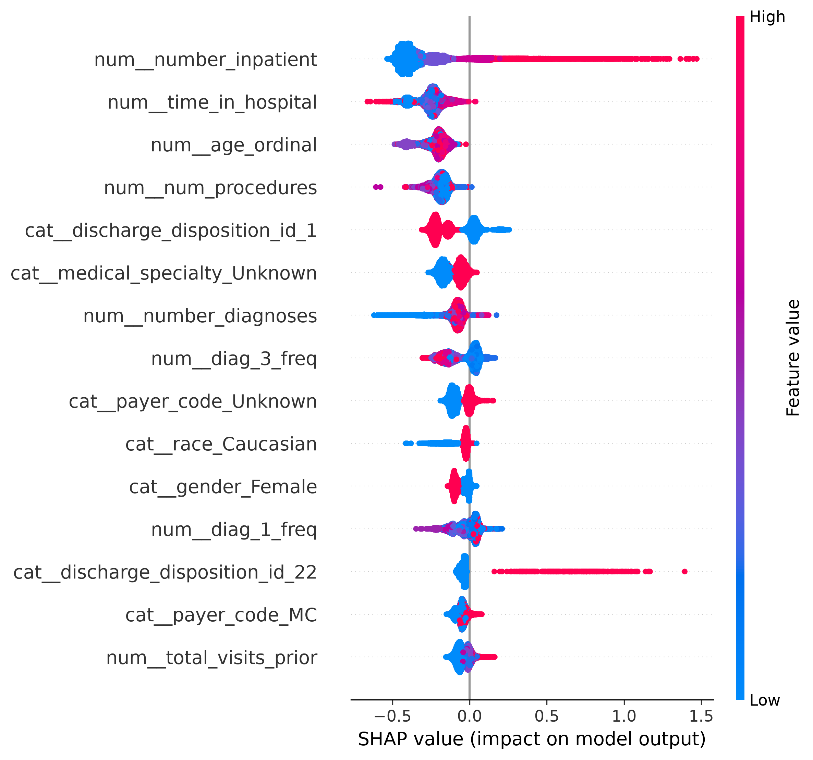
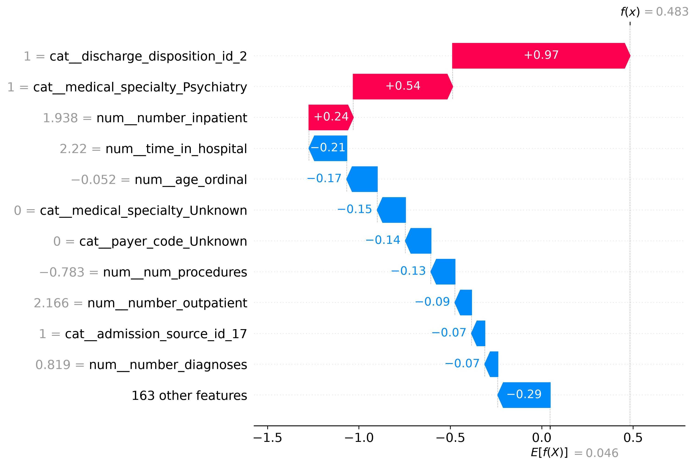
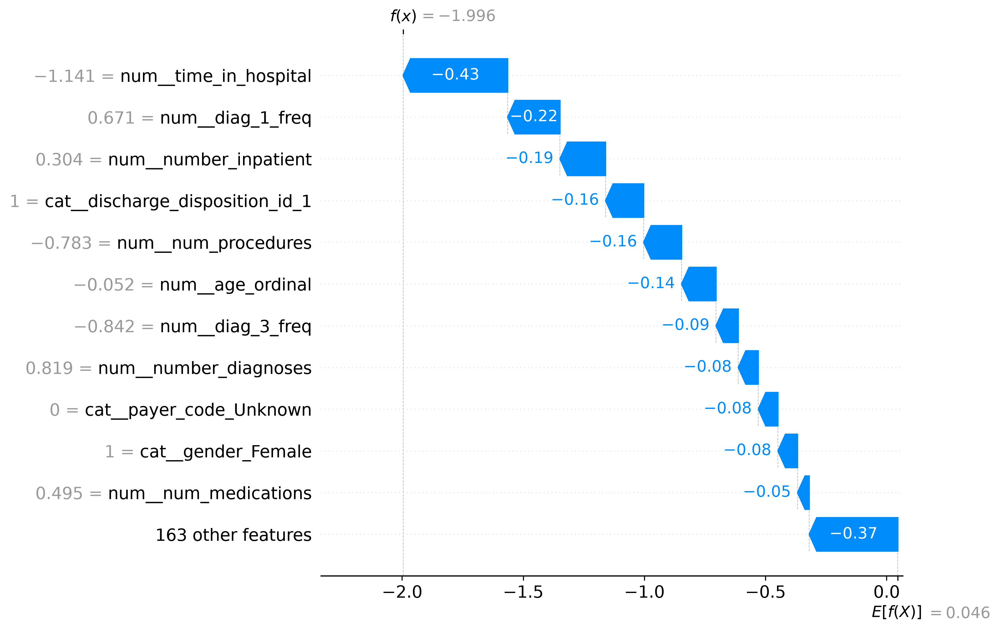
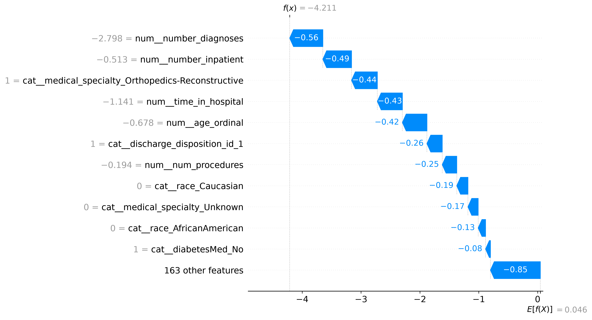
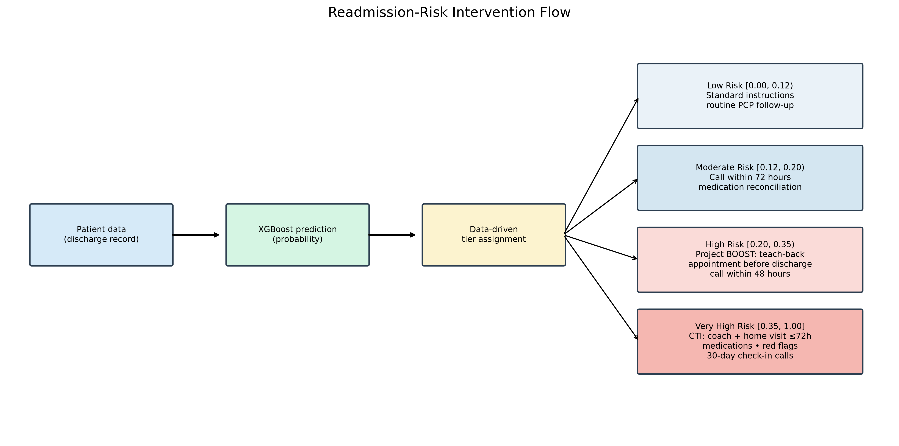
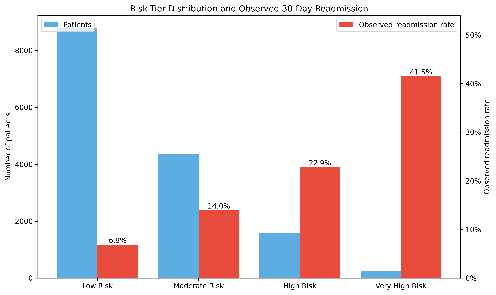
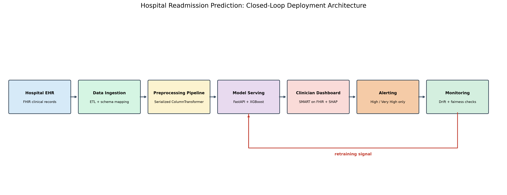

# Hospital Readmission Prediction from Diabetes Inpatient Encounters: A Leakage-Aware, Interpretable, and Fairness-Conscious Pipeline

## Abstract

Thirty-day hospital readmission is a costly quality-of-care outcome, yet prediction is difficult because relevant clinical and social information is often incomplete at discharge. This study develops an end-to-end readmission-risk pipeline using the UCI Diabetes 130-US Hospitals dataset. The workflow cleans encounter data, excludes patients whose discharge disposition indicates death, engineers utilization and medication-change features, and uses patient-grouped data splits to prevent encounters from the same patient appearing in more than one partition. Class imbalance is addressed with SMOTE inside each cross-validation fold through an imbalanced-learn pipeline. Logistic Regression, Random Forest, Decision Tree, and XGBoost models are evaluated. XGBoost provides the strongest validation ranking performance (ROC-AUC 0.6839), and its decision threshold is reduced from 0.50 to 0.12 to prioritize clinically important recall. At this threshold, XGBoost achieves validation recall 0.6369 and precision 0.1777 at the matched-recall operating point. SHAP analysis identifies prior inpatient utilization, length of stay, age, procedures, and discharge disposition as leading contributors. Fairness analysis identifies an age-specific recall gap for patients aged 50-60, and a retrospective threshold-calibration experiment shows that recall can improve from 0.5301 to 0.6265 with a modest precision reduction. The project concludes with risk-tiered transition interventions and a deployment architecture for monitored clinical decision support.

**Keywords—** hospital readmission; clinical machine learning; XGBoost; SMOTE; SHAP; fairness; care transitions.

## I. Introduction

Hospital readmissions impose substantial costs on the United States health system, commonly estimated at roughly $26 billion annually, and have motivated quality programs such as the Hospital Readmissions Reduction Program (HRRP). HRRP reduces payments to hospitals with excess readmissions for selected conditions, including heart failure, chronic obstructive pulmonary disease (COPD), and pneumonia [1]. Readmission is not solely a modeling target: it is a care-transition problem in which discharge preparation, medication understanding, follow-up access, and patient self-management all matter.

This project predicts whether a diabetes-related inpatient encounter will be followed by a readmission within 30 days using the UCI Diabetes 130-US Hospitals dataset [2]. The goal is deliberately broader than a probability score. The pipeline converts the score into risk tiers and transition-of-care interventions, explains individual and global predictions, evaluates subgroup performance, and proposes a monitored deployment architecture. The study therefore treats prediction as one component of a clinician-supervised workflow.

The remainder of the report reviews relevant literature, describes the dataset and leakage-aware preprocessing, evaluates four classifiers and their threshold selection, presents SHAP and fairness analyses, maps risk to interventions, and describes a production-oriented architecture.

## II. Related Work

Readmission prediction models are frequently limited by modest discrimination and heterogeneous outcome definitions. Kansagara *et al.* reviewed validated models and emphasized their role in identifying patients who may benefit from care-transition interventions, while also noting limitations in prediction performance and clinical usability [3]. This motivates reporting both ranking metrics and a clinically selected operating threshold rather than presenting ROC-AUC as sufficient evidence for deployment.

The present dataset originates from a diabetes inpatient cohort analyzed by Strack *et al.* in relation to HbA1c measurement and early readmission [2]. Clinical readmission data are generally imbalanced, so resampling must be applied carefully. SMOTE creates synthetic minority examples [4], but when applied before cross-validation it can place related synthetic examples across training and validation folds. This project therefore fits SMOTE only within each fold through an imbalanced-learn pipeline.

Interpretability is essential when a model is intended to support care planning. SHAP provides an additive attribution framework for explaining individual predictions and aggregate feature effects [5]. In this study, TreeExplainer is used for the selected XGBoost estimator, enabling both a global summary and patient-level waterfall plots.

## III. Dataset and Preprocessing

### A. Dataset characteristics and data-quality audit

The raw dataset contains 101,766 encounters and 50 columns, representing 71,518 unique patients. Of these patients, 16,773 had multiple encounters, meaning that 23% of patients recur in the data. This recurrence makes ordinary row-level splitting unsafe: a model may learn a patient's historical pattern in training and appear to generalize when evaluated on another encounter for the same patient.

The initial 30-day target identifies 11,357 encounters as readmitted and 90,409 as not readmitted, an imbalance ratio of 7.96:1. The missing-value audit identified weight (96.9%), `max_glu_serum` (94.7%), and `A1Cresult` (83.3%) as near-unusable fields. `medical_specialty` was 49.1% missing, `payer_code` 39.6% missing, and race 2.2% missing. Weight, `max_glu_serum`, and `A1Cresult` were removed after preserving glucose- and A1C-test-recorded indicators; `medical_specialty`, `payer_code`, race, and diagnosis fields were assigned explicit unknown categories where needed.

An additional clinical validity audit identified discharge dispositions denoting death: 11 (Expired), 19 (Expired at home), 20 (Expired in a medical facility), and 21 (Expired, place unknown). These patients cannot be readmitted. Retaining them would create a spurious negative-risk signal and distort subgroup comparisons. The final preprocessing run removed 1,652 of 101,766 encounters (1.62%). The pre-filter readmission rate was 11.1599%; it was 11.3441% after exclusion, because all removed records were target-negative. The filtered dataset contains 100,114 encounters, with 88,757 negative and 11,357 positive outcomes.

### B. Feature engineering and encoding

Two compact clinical-history features were added. `num_med_changes` counts deviations from the modal value across approximately 20 near-constant medication columns, avoiding a sparse collection of low-information drug indicators. `total_visits_prior` sums prior outpatient, emergency, and inpatient utilization. The three diagnosis codes were frequency encoded, age bands were ordinal encoded in their natural order from [0-10) through [90-100), and the remaining categorical variables were one-hot encoded. A `ColumnTransformer` performed median numerical imputation and standardization together with categorical imputation and one-hot encoding.

Patients—not encounters—were split into 70% training, 15% validation, and 15% test partitions. The grouped split produced zero patient overlap across partitions. The final transformed test partition contains 14,997 rows and 174 features.

### C. Leakage prevention and class imbalance

SMOTE was embedded with the estimator in an `imblearn.pipeline.Pipeline`, so it is refit only on each training fold. This design followed the discovery of a severe leakage failure: applying SMOTE globally before cross-validation produced Random Forest and Decision Tree cross-validation recalls above 90% but near-zero validation recall, consistent with memorization of synthetic neighbors crossing fold boundaries. Encapsulating SMOTE in the pipeline prevents those artificial relationships from entering validation folds and produces a credible estimate of generalization. The resulting procedure follows the rationale of SMOTE while respecting the independence of held-out examples [4].

## IV. Methodology

Four classifiers were evaluated: Logistic Regression as a linear baseline; Random Forest as a bagged non-linear ensemble; Decision Tree as an interpretable tree baseline; and XGBoost as a gradient-boosted tree model. Logistic Regression, Random Forest, and XGBoost were tuned with `GridSearchCV`; the final training workflow retained the selected configurations when removing expired-patient data required refitting under constrained Windows execution. Stratified five-fold cross-validation was run with SMOTE refit in every fold.

Validation ranking used ROC-AUC, while precision, recall, F1, and PR-AUC were reported to describe the positive class. A separate threshold sweep searched 0.05 to 0.50 for each saved model and selected the threshold with the highest precision subject to recall at or above approximately 0.60. This separates the model's ability to rank patients from the operational threshold used to allocate care-transition resources.

## V. Results

### A. Validation and cross-validation performance

Table I reports validation results at each model's default prediction behavior. XGBoost has the best validation ROC-AUC (0.6839) and PR-AUC (0.2477), although its default recall is only 0.0256. Logistic Regression offers substantially higher default recall (0.5758) at lower accuracy. These contrasts show why a default 0.50 cutoff is not suitable for the project's clinical objective.

**Table I. Validation metrics.**

| Model | Accuracy | Precision | Recall | F1 | ROC-AUC | PR-AUC |
|---|---:|---:|---:|---:|---:|---:|
| Logistic Regression | 0.6559 | 0.1817 | 0.5758 | 0.2762 | 0.6689 | 0.2260 |
| Random Forest | 0.8296 | 0.2301 | 0.2110 | 0.2201 | 0.6584 | 0.1968 |
| Decision Tree | 0.8564 | 0.3008 | 0.1958 | 0.2372 | 0.6488 | 0.1945 |
| XGBoost | 0.8861 | 0.5057 | 0.0256 | 0.0488 | 0.6839 | 0.2477 |

**Table II. Stratified five-fold cross-validation means (standard deviations retained in the project CSV).**

| Model | Accuracy | Precision | Recall | F1 | ROC-AUC |
|---|---:|---:|---:|---:|---:|
| Logistic Regression | 0.6405 | 0.1698 | 0.5567 | 0.2602 | 0.6465 |
| Random Forest | 0.8316 | 0.2203 | 0.1901 | 0.2039 | 0.6447 |
| Decision Tree | 0.8489 | 0.2560 | 0.1738 | 0.2070 | 0.6253 |
| XGBoost | 0.8866 | 0.5247 | 0.0142 | 0.0276 | 0.6550 |

### B. Threshold selection and clinical operating point

At matched recall, XGBoost remains the strongest ranking model. Table III shows that its threshold of 0.12 yields recall 0.6369, precision 0.1777, and ROC-AUC 0.6839. Logistic Regression at 0.49 has recall 0.6090, precision 0.1784, and ROC-AUC 0.6689. Although Logistic Regression is fractionally higher in matched-recall precision, XGBoost better ranks patients and reaches the higher recall level; it was selected as the final model. The approximately 0.07 percentage-point precision difference is within noise, whereas XGBoost's approximately 2.8 percentage-point recall advantage (0.6369 versus 0.6090) and higher ROC-AUC were the deciding factors.

**Table III. Threshold comparison at recall near 0.60.**

| Model | Threshold | Precision | Recall | ROC-AUC |
|---|---:|---:|---:|---:|
| Logistic Regression | 0.49 | 0.1784 | 0.6090 | 0.6689 |
| XGBoost | **0.12** | 0.1777 | **0.6369** | **0.6839** |
| Random Forest | 0.38 | 0.1741 | 0.6084 | 0.6584 |
| Decision Tree | 0.32 | 0.1709 | 0.6031 | 0.6488 |

The threshold choice reflects clinical cost asymmetry. A false negative may mean that a patient at genuine risk receives no additional discharge support, medication review, or timely follow-up. A false positive may consume care-coordination effort, but it can usually be addressed through non-invasive transition support. For this use case, the harm of missing a patient who could benefit from prevention is treated as greater than the cost of offering an extra call or review. Thus, 0.12 is preferred to the conventional 0.50 cutoff because it converts XGBoost's useful ranking ability into an operating point with approximately 64% validation recall.

The final model's default-threshold test artifacts are shown in Fig. 1 and Fig. 2. They should be interpreted together with the threshold analysis: the final deployment decision is 0.12, not the default binary output used in the saved test confusion matrix.

## VI. Interpretability

SHAP TreeExplainer was applied to the final XGBoost estimator on all 14,997 test encounters. The leading global feature was prior inpatient utilization (mean absolute SHAP value 0.3478), followed by time in hospital (0.2512), ordinal age (0.2247), number of procedures (0.1926), and discharge disposition 1 (0.1349). The complete top-ten list is given in Table IV.

**Table IV. Top SHAP features.**

| Feature | Mean absolute SHAP |
|---|---:|
| `num__number_inpatient` | 0.3478 |
| `num__time_in_hospital` | 0.2512 |
| `num__age_ordinal` | 0.2247 |
| `num__num_procedures` | 0.1926 |
| `cat__discharge_disposition_id_1` | 0.1349 |
| `cat__medical_specialty_Unknown` | 0.1106 |
| `num__number_diagnoses` | 0.1010 |
| `num__diag_3_freq` | 0.0900 |
| `cat__payer_code_Unknown` | 0.0708 |
| `cat__race_Caucasian` | 0.0587 |

Patient-level waterfall plots provide complementary cases: Patient A is a true positive, Patient B is a false negative at the 0.12 operational threshold, and Patient C is a true negative. The false-negative example is especially important: a model driven strongly by prior utilization and observed admission-history features can miss patients whose subsequent risk emerges from social, behavioral, or post-discharge factors not represented in structured admission data. The plots should support, not substitute for, clinician judgment.

The interpretability review also exposed a data artifact: `discharge_disposition_id_11` represented a deceased patient. Expired dispositions 11, 19, 20, and 21 were removed before final modeling, so this feature no longer appears in the final SHAP outputs.

## VII. Fairness and Ethics

Subgroup evaluation used the deployment threshold of 0.12. Race recalls ranged from 0.4722 for the unknown-race group (support 350) to 0.6493 for the Caucasian group (support 11,221); the Asian group had recall 0.5238 with support 117. Gender recall was 0.6615 for female patients (support 8,006) and 0.6181 for male patients (support 6,991). Several small groups should not be over-interpreted; the [0-10) and [10-20) age bands have sample sizes of 26 and 79, respectively.

The most credible gap occurs in the [50-60) band: support is 2,592 and recall is 0.5301, compared with overall test recall 0.6413. A retrospective per-group threshold experiment lowered the threshold for this age band from 0.12 to 0.10. Recall increased to 0.6265, while precision fell from 0.1777 to 0.1622, a 1.55 percentage-point reduction. This demonstrates that the observed gap is addressable, but it is not a deployment recommendation. The same calibration exercise shifted some other bands unfavorably: [70-80) moved from 0.6918 recall at the global threshold to 0.5055 under its selected threshold, and [80-90) moved from 0.6991 to 0.4608. Thresholds must therefore be chosen on validation data and subjected to clinical, ethical, and governance review rather than silently varied by subgroup.

In a real deployment, protected health information requires institution-specific HIPAA [8] and, where applicable, GDPR [10] governance. Development data should be de-identified where feasible, access should be role-based, and scoring and data access should be auditable. A hospital integration would use HL7 FHIR resources [9] and should disclose in plain language that an algorithm contributes to readmission-risk assessment. The score is clinical decision support, never an automated disposition: clinicians must be able to override it using information absent from structured data, including patient conversations and caregiver context.

## VIII. Intervention Design

Predicted probabilities were converted into four tiers using observed test-set risk rather than arbitrary cutoffs. Observed readmission increased from 6.9% below 0.12 to 14.0% in 0.12-0.20, 22.9% in 0.20-0.35, and 41.5% at or above 0.35. The 0.50+ bin contained only 31 patients and was combined into the very-high tier. Table V maps each tier to a graduated intervention.

**Table V. Risk tiers and care-transition actions.**

| Tier | Probability range | Support | Observed rate | Recommended action |
|---|---|---:|---:|---|
| Low | [0.00, 0.12) | 8,786 | 6.9% | Standard instructions and routine primary-care follow-up. |
| Moderate | [0.12, 0.20) | 4,367 | 14.0% | Call within 72 hours and medication reconciliation. |
| High | [0.20, 0.35) | 1,584 | 22.9% | Project BOOST-style teach-back, scheduled follow-up, and a call within 48 hours. |
| Very High | [0.35, 1.00] | 260 | 41.5% | Care Transitions Intervention (CTI): coach, home visit within 72 hours, medication reconciliation, red-flag education, and 30-day calls. |

Project BOOST supports structured discharge planning, patient education using teach-back, and follow-up coordination [6]. CTI is an evidence-based transition-coaching model with medication management, follow-up, and warning-sign education [7]. The tiering logic should be treated as a resource-allocation prototype that requires local clinical validation.

## IX. Deployment Architecture

The proposed deployment architecture begins with hospital EHR data exchanged through HL7 FHIR. An ETL layer extracts encounter, condition, medication request, and observation resources at discharge and maps them into the training feature schema. The saved `preprocessing_pipeline.joblib` ColumnTransformer is loaded at service start so production transformations match training transformations exactly. The XGBoost pipeline is served through a Dockerized FastAPI service, versioned in a model registry, and deployed behind a load balancer or managed platform.

The clinician-facing component is a SMART on FHIR application showing risk probability, tier, recommended intervention, and patient-specific SHAP explanations. Only high and very-high tiers create active care-coordination alerts; low and moderate tiers are displayed passively to reduce alert fatigue. Monitoring compares live and training feature distributions for data drift, tracks outcome-linked performance for concept drift, and reruns subgroup metrics for fairness drift. The feedback loop triggers governance review and a retraining signal rather than automatic model replacement.

## X. Discussion and Limitations

The final ROC-AUC of 0.6839 is useful but modest. This is consistent with the broader readmission-prediction literature, where outcomes are affected by factors that may be unavailable in structured inpatient data, including social support, outpatient access, adherence, and changing symptoms [3]. The model should therefore guide additional review and support, not be interpreted as a deterministic forecast.

The fairness analysis identifies meaningful variation but also substantial uncertainty in small subgroups. Supports below 300 were explicitly flagged in the threshold-calibration study. The very-high-risk tier shows a strong observed rate but contains only 260 patients; moreover, its extreme 0.50+ portion has only 31 patients. These small counts limit the reliability of finely divided threshold policies. Finally, the subgroup calibration experiment is retrospective and uses the held-out test set for demonstration; a real policy must be tuned on validation data, externally validated, and monitored prospectively.

## XI. Conclusion

This capstone implemented a leakage-aware diabetes readmission pipeline that joins grouped splitting, fold-specific SMOTE, threshold selection, SHAP explanation, fairness assessment, intervention design, and deployment planning. XGBoost provided the best validation ranking performance, and a 0.12 threshold achieved recall 0.6369 at the matched-recall operating point. The results demonstrate both the promise and limits of structured-data prediction: prior utilization and hospitalization features can identify many patients who may benefit from transition support, but fairness gaps, missing social context, and modest discrimination require clinical oversight. The recommended next step is prospective validation of the workflow, including governance-approved monitoring of performance, fairness, and intervention capacity.

## References

[1] Centers for Medicare & Medicaid Services, “Hospital Readmissions Reduction Program (HRRP),” 2026. Available: https://www.cms.gov/medicare/payment/prospective-payment-systems/acute-inpatient-pps/hospital-readmissions-reduction-program-hrrp

[2] B. Strack, J. P. DeShazo, C. Gennings, J. L. Olmo, S. Ventura, K. J. Cios, and J. N. Clore, “Impact of HbA1c Measurement on Hospital Readmission Rates: Analysis of 70,000 Clinical Database Patient Records,” *BioMed Research International*, vol. 2014, Art. no. 781670, 2014, doi: 10.1155/2014/781670.

[3] D. Kansagara, H. Englander, A. Salanitro, *et al.*, “Risk Prediction Models for Hospital Readmission: A Systematic Review,” *JAMA*, vol. 306, no. 15, pp. 1688-1698, 2011, doi: 10.1001/jama.2011.1515.

[4] N. V. Chawla, K. W. Bowyer, L. O. Hall, and W. P. Kegelmeyer, “SMOTE: Synthetic Minority Over-sampling Technique,” *Journal of Artificial Intelligence Research*, vol. 16, pp. 321-357, 2002, doi: 10.1613/jair.953.

[5] S. M. Lundberg and S.-I. Lee, “A Unified Approach to Interpreting Model Predictions,” in *Advances in Neural Information Processing Systems 30*, 2017, pp. 4765-4774.

[6] Society of Hospital Medicine, *Project BOOST Implementation Guide*, 2nd ed. Philadelphia, PA, USA, 2024. Available: https://www.hospitalmedicine.org/wp-content/uploads/2024/11/boost-guide-second-edition.pdf

[7] E. A. Coleman, C. Parry, S. Chalmers, and S.-J. Min, “The Care Transitions Intervention: Results of a Randomized Controlled Trial,” *Archives of Internal Medicine*, vol. 166, no. 17, pp. 1822-1828, 2006, doi: 10.1001/archinte.166.17.1822.

[8] U.S. Department of Health and Human Services, “Summary of the HIPAA Security Rule,” 2026. Available: https://www.hhs.gov/hipaa/for-professionals/security/laws-regulations/index.html

[9] HL7 International, “FHIR Release 4,” 2019. Available: https://www.hl7.org/fhir/

[10] European Parliament and Council, “Regulation (EU) 2016/679 (General Data Protection Regulation),” 2016. Available: https://eur-lex.europa.eu/eli/reg/2016/679/oj
